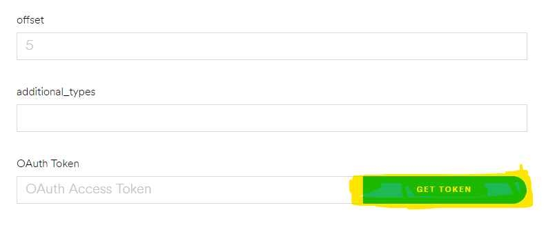

# Spotify API Token Generation Guide

---

1. Go to [Spotify Developer Console][https://developer.spotify.com/console/].

2. Click on **Playlists**.

   

3. Select **Get a Playlist's items**.

   

4. Scroll down and select **OAuth Token**.

   

5. Check **playlist-read-private** and **playlist-read-collaborative**. Then click on **REQUEST TOKEN**.

   

6. Copy the token. Insert this into the box which requests for the Spotify API Token in the Spotify Downloader application.

### Note: This token needs to be generated every time the application is used.

