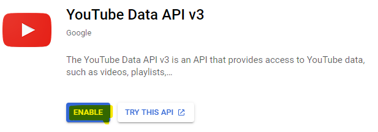

# YouTube API Token Generation Guide

---

1. Go to [Google Cloud Console](https://console.cloud.google.com).

2. If required, Login to your google account first.

3. Click on **Select a project**.

   

4. Select **NEW PROJECT**.

   

5. Name the project *YouTube Parser* and click on **Create**.

   

6. Click on **Select a project** and then select YouTube Parser.

   

7. Click on **APIs & Services**.

   

8. Click on **ENABLE APIS AND SERVICES**.

   

9. Search for *YouTube* and Select **YouTube Data API v3**.

   

10. Click **ENABLE**.

    

11. After it loads, click on **CREATE CREDENTIALS**.

    

12. Fill out the form with the options shown in the image below and click **What credentials do I need?**

    

13. Copy the generated Key and store it in a secure location, then click on **Done**.

    

14. The generated key can be used in the Spotify Downloader application.